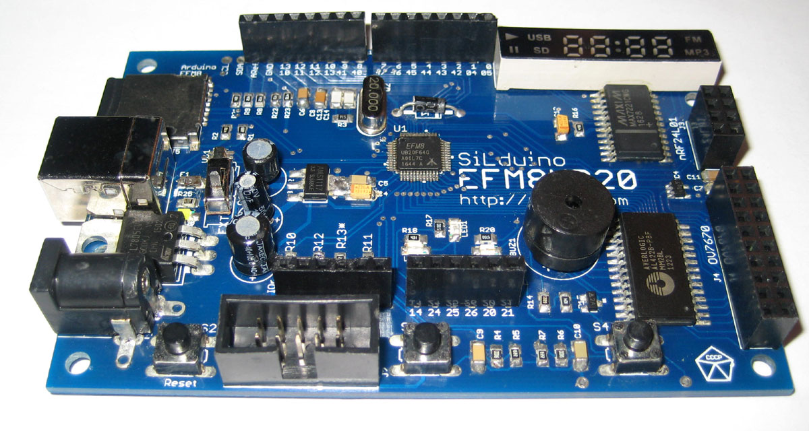

### Example firmware for my **EFM8UB2 development board** based on [SiLbas 8-bit MCU](https://www.silabs.com/products/mcu/8-bit).
> These simple projects can be used for tutorial purposes.
Required header files and libraries are stored in `inc` and `lib` folders.
Project files were created with the [Keil uVision C51](http://www.keil.com/c51/).
> Functions for initialization for the on-board perephirials are located in `board.c` file.
# EFM8UB2_Board

# This is the MCU

## TODO
- [x] Initial commit :+1:
- [ ] PCA/Ports change - remove LED_YELLOW PWM
- [ ] UART_init and tests
- [ ] Upload schematis
- [ ] Write an article

P.S. [GitHub readme tips&tricks](https://help.github.com/articles/basic-writing-and-formatting-syntax/)
